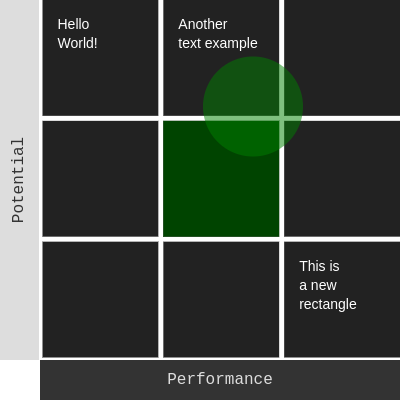

# ninebox-chart
A simple javascript library to create ninebox matrix



#####To use the ninebox-chart, first you must create an instance of the class
```javascript
chart = new Chart('Potential', 'Performance')
```

1. The first parameter is the text of the **vertical** ruler of the chart
2. The second parameter is the text of the **horizontal** ruler of the chart

#####After that, you must setup the canvas properties
```javascript
chart.setupCanvas(400, 400, 5, 40)
```
1. **Canvas width**
2. **Canvas height**
3. **Rectangle margin**
4. **Ruler size**

#####Then you'll want to change each ruler's colour
```javascript
chart.setupRuler('vertical', 'Potential', 16, '#DDD', '#333')
chart.setupRuler('horizontal', 'Performance', 16, '#333', '#DDD')
```
1. The first parameter stands for the **ruler name** that you're changing
2. The second parameter is the **text inside the ruler**
3. The third parameter is the **font size**
4. The fourth parameter is the **background colour**
5. The fifth parameter is the **font colour**

#####After setting the rulers, you'll want to specify your nine box matrix values
```javascript
chart.setVerticalPeriod(0, 100, 3)
chart.setHorizontalPeriod(0, 100, 3)
```
1. For both functions, the first parameter is the **start value** of your matrix
2. The second parameter is the **limit value**
3. And the third parameter is the **number of rows and columns** of the chart respectively

#####With all set, now you can ask for the library to draw your chart
```javascript
chart.drawRectList('#222', true)
```
1. The first parameter is the **colour of the rectangles**
2. The second parameter is if the rectangles are **filled or not**

#####You can also set the colour of a specific rectangle
```javascript
chart.setRectColour(5, '#040')
```
1. The first parameter is the **id** of the rectangle
2. The second parameter is the **colour** of the rectangle

#####Now, you can set a persistent font for your chart. It's optional
```javascript
chart.setPersistentFont('Arial', 14, '#FFF', 15, 5)
```
1. The first parameter is the **font face**
2. The second parameter is the **font size**
3. The third parameter is the **font colour**
4. The fourth parameter is the **font margin**
5. The fifth parameter is the **line height**

#####Now that you have a persistent font, you can draw in specific rectangles
```javascript
chart.drawTextOnRect(1, 'Hello[%]World!')
chart.drawTextOnRect(2, 'Another[%]text example')
chart.drawTextOnRect(9, 'This is[%]a new[%]rectangle')
```
1. The first parameter is the **rectangle id**. To know the id, simply count from left to right and top to down
2. The second parameter is the **text**. The **[%]** symbol represents a new line

#####And finally, you'll want to place the circle marker on your chart

######First, get the position on the canvas by using the matrix values with the function *getPeriodPosition*
```javascript
circlePos = chart.getPeriodPosition(70, 25)
```
1. The first parameter is the **horizontal value of your matrix**
2. The second parameter is the **vertical value of your matrix**

######Now with the position values, you can use the function <i>drawCircle</i> to draw your marker
```javascript
chart.drawCircle(circlePos.x, circlePos.y, 50, 'green', 0.5)
```
1. The first parameter is the **X position**
2. The second parameter is the **Y position**
3. The third parameter is the **radius** of your marker
4. The fourth parameter is the **colour** of your marker
5. The fifth parameter is the **opacity** of your marker

#####Finally you can ask the library to build your canvas
```javascript
chart.buildCanvas()
```